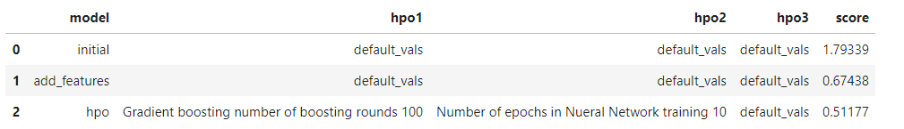
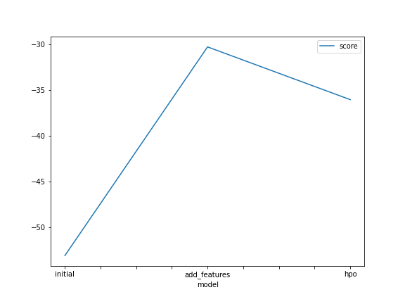
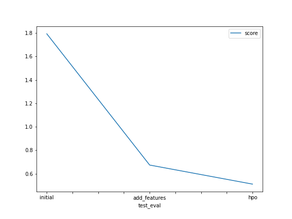

# Report: Predict Bike Sharing Demand with AutoGluon Solution
#### PRANAV JAIN

## Initial Training
### What did you realize when you tried to submit your predictions? What changes were needed to the output of the predictor to submit your results?
It was expected to rest all the negative predictions to zero as Kaggle did not accept negative predictions as per the problem statement. But, when 
I tried searching for negative values in the predictions, I did not find any values. Then also, I wrote the appropriate code so that in the future, 
if any model trained on Autogluon gave negative predictions, they were set to zero to avoid any discrepancy arising.

### What was the top ranked model that performed?
When performing training for raw submission, WeightedEnsemble_L3 came out to be the top ranked model with a score_val -53.126148.

## Exploratory data analysis and feature creation
### What did the exploratory analysis find and how did you add additional features?
The exploratory data analysis tried to find new features based upon the parsed "datetime" feature of the dataset
(eg date,hour,month, etc). Using the datetime module found inside Python and to_datetime function in Pandas, I first 
parsed the datetime column and then retrieved new hour feature from it and attached it to the dataset.

Apart from it, I also converted the data type of the "season" and "weather" columns of train and test dataset to int 
using astype method available in pandas.

### How much better did your model preform after adding additional features and why do you think that is?
The kaggle score improved much from being 1.79339 during raw submission to 0.67438.

I think that the new feature extraction(creation of "hour" feature) led to better training of 
models over Autogluon. Also, the conversion of the data type of columns for train and test data 
faciliated in their usage for better training of models.

## Hyper parameter tuning
### How much better did your model preform after trying different hyper parameters?
I tried toggling between the entensive hyperparameters for different models available in Autogluon library
such as:-
1) Number of leaves and max depth in Random Forests 
2) Criterion and alpha parameter in XGboost algorithm
3) learning rate for FASTAI and CATboost

Even after performing several training iterations agagin and again, I was not able to get the model score up to my expectations
So, I decided to switch the hyperparameters for very basic models like Nueral networks(NN_TORCH) and Gradient Boosting(GBM):-
1) For  NN_TORCH, I used the hyperparameters num_epochs, learning_rate, activation and dropout_prob and continued changing their values across training iterations
2) For GBM,  I used the hyperparameters num_boost_rounds and num_leaves and continued changing their values across training iterations

While training, I realised that although the overall model score for WeightedEnsemble_L3 was less than wht i got previously(-36.055729),
the overall Kaggle score was much better(0.51177). Thus, i stopped at this stage and fixed the hyperparameter tuned model.

### If you were given more time with this dataset, where do you think you would spend more time?
If I was given extra time, I would have tried to explore experimenting some more hyperparameters for the best performing models being 
trained on Autogluon so as to improve my overall score such as:-
1) Depth and learning rate for CATBoost Algorithm
2) Number of features in KNN Algorithm
3) Early Stopping Rounds in Gradient Boosting Algorithm

### Create a table with the models you ran, the hyperparameters modified, and the kaggle score.
|model|hpo1|hpo2|hpo3|score|
|--|--|--|--|--|
|initial|"default-vals"|"default-vals"|"default-vals"|1.79339|
|add_features|"default-vals"|"default-vals"|"default-vals"|0.67438|
|hpo|"Gradient boosting number of boosting rounds 100"|"Number of epochs in Nueral Network training 10"|"default_vals"|0.51177|

### Create a line plot showing the top model score for the three (or more) training runs during the project.

### Create a line plot showing the top kaggle score for the three (or more) prediction submissions during the project.

## Summary
Throughout the 7 steps, the summary of our work can be given as:

First, we downloaded the datasets from Kaggle and performed training on them by fitting different models using Autogluon. Using the
credentials provided by the custom Kaggle API token, we made our first raw submission. As expected, it does not give great results as 
the data has not been processed well. 

Next, we enter the phase of feature engineering wherein we try to extract new features from the data by analysing it. We also tried to
improve performance by converting data types of some of the column values to appropriate data type to be used while training. This helped us
achieve better performance than before. 

Still, we could improve more by playing with the hyperparameters of the models being fitted to the data by using hyperparameter optimisation
Using optimum subset of the hyperparameters using grid or random search, we came out to have a more quality performance than before
Upon trying again and again, we find that we are not able to improve our models performance further. At this stage, we can conclude that 
we have reached at an optimum stage of model performance.
